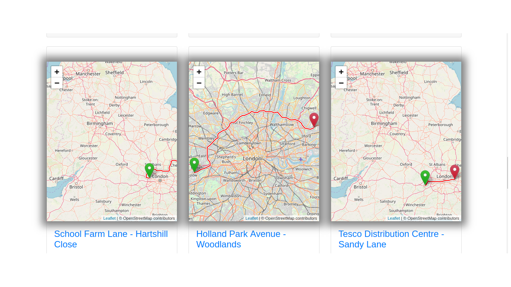

 # HitchHike
 
This is a Django web app that allows people to help other people get from one place to another by offering them a ride.
The project its still in development and with the help of people we could deploy it and make it available for the whole wolrd.
    
 _Homepage:_ 

 _Sign Up:_

 _Add New Ride:_

    
 **Usage**
   1.  Clone the reposetory
   2.  Create virtual enviroment with python3.6
   3.  Activate virtual enviroment
   4.  pip install requirements.txt
   5.  Set up a [postgresql](https://www.techrepublic.com/blog/diy-it-guy/diy-a-postgresql-database-server-setup-anyone-can-handle/) database 
   6.  Set up [OSRM](https://www.digitalocean.com/community/tutorials/how-to-set-up-an-osrm-server-on-ubuntu-14-04)
   7.  Go to HitchHike and run python manage.py runserver
   
